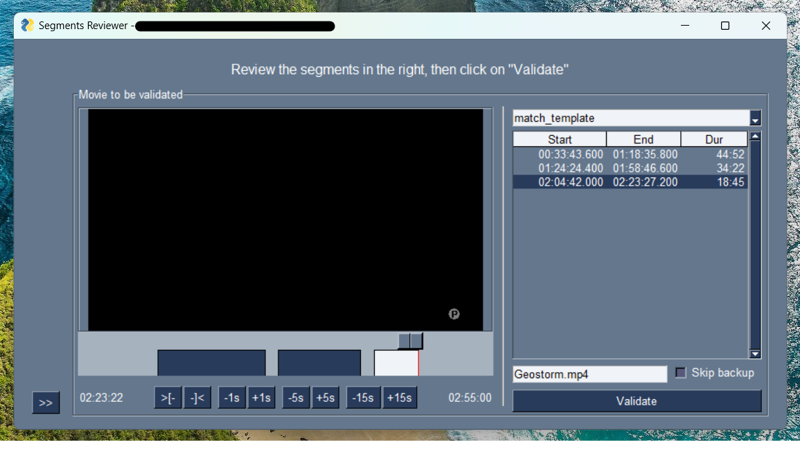

# movie pipeline segments validator

A simple GUI to review the part of the video to be kept and generate the edit decision file
for the movie pipeline process command.

## Installation

After installing poetry, just run the following command in the project root:

```sh
poetry install
```

## Usage example

Just run ```python segment_validator.py```, choose a file or a folder to review and follow the instruction on screen.



An API is also available. Run ```python server.py```, and open [http://localhost:8000/docs](http://localhost:8000/docs)
to access the built-in documentation.

### Requirements

A video MUST meet the following requirements to be processed by this program.

Given a video named `Channel 1_Serie Name. 'Title..._2022-12-05-2203-20.ts`:

- The medatadata file MUST exist and:

  - MUST have the following name : `Channel 1_Serie Name. 'Title..._2022-12-05-2203-20.ts.metadata.json`

  - At least HAVE the same shape than this example:

    ```json
    {
        "title": "Serie Name",
        "sub_title": "Serie Name : Episode Name. Série policière. 2022. Saison 1. 16/26.",
        "description": ""
    }
    ```

- The result of the ```movie_pipeline detect_segments``` MIGHT exists and
  - MUST have the following name: `Channel 1_Serie Name. 'Title..._2022-12-05-2203-20.ts.segments.json`

  - MUST comply to the following schema:

    ```python
    detected_segments_schema = Schema({ str: Regex(r'(?:(?:\d{2}:\d{2}:\d{2}\.\d{2,3})-(?:\d{2}:\d{2}:\d{2}\.\d{2,3}),)+') })
    ```

  > **NOTE**
  >
  > Each key of the `.segments.json` document is the name given to the detected parts of a video that should be kept.
  >
  > The segments to be checked are populated from this file.
  >
  > Whenever you change the video you are reviewing, the currently reviewed segments that you want to keep are saved to this file.

## Release History

- V0.2.2
  - Normalize episode title for extract_title_serie_episode_from_metadata title
  - Do not load segments content when creating API session. These segments can be retrieved when getting a media.

- V0.2.1
  - Improve API performance

- V0.2.0
  - Introduce new API for headless segment validations. Documentation is available at localhost:8000/docs

- V0.1.4
  - Deprecate pysimplegui renderer

- V0.1.3
  - Create movie_pipeline_segment_validator package

- V0.1.2
  - Update the title extractor to the latest version.
    - Given a file containing the series name and the name of each episode with the formatted episode number,
        the title extractor can derive the formatted episode number of the series
        from the extracted episode name of the video.

- V0.1.1
  - Add support to review a directory directly from the GUI

- V0.1.0
  - Extract segment validator from the movie-pipeline repository
